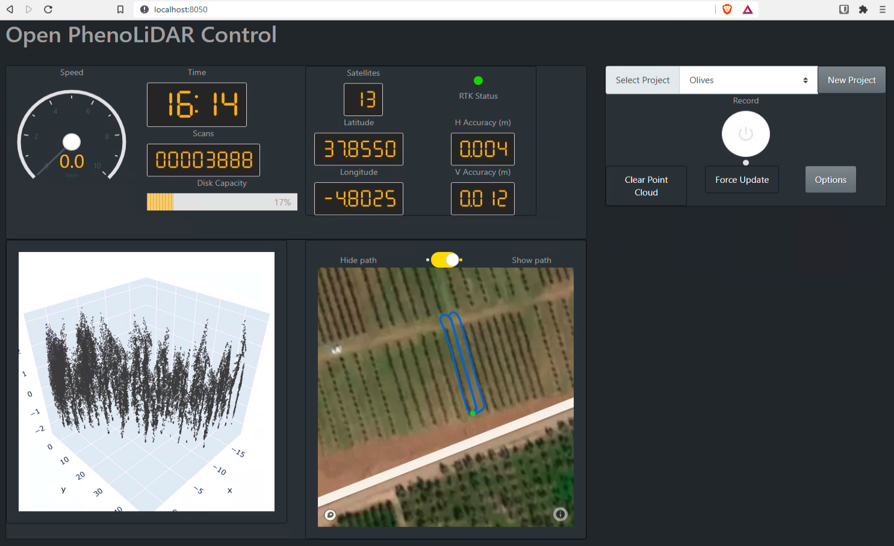

# Open-PhenoLiDAR

[](https://doi.org/10.5281/zenodo.5101085)

Citation: Jose A. J. Berni, & Sergio Bellido. (2021, July 14). OpenAgriTech/Open-PhenoLiDAR: Public realease for Zenodo (Version 0.1.1). Zenodo. http://doi.org/10.5281/zenodo.5101085

## What is Open  PhenoLiDAR?

**Open PhenoLiDAR**, an open-source pipeline for integrating LiDAR sensors in plant phenotyping and, more broadly, for
crop monitoring applications. Open PhenoLiDAR spans from data acquisition (including instructions for integrating the
LIDAR and GNSS receiver) to data analysis and obtaining primary plant traits. The data acquisition and sensor
integration are developed using ROS (Robotic Operating System), which provides modularity for adopting different LiDAR
models and GNSS/IMU receivers. ROS also enables compatibility for integrating other sensors, such as machine vision or
hyperspectral cameras. ROS also presents advantages for further adoption of robotic solutions or autonomous navigation.
The current version supports the LMS400 (Sick, Germany) LiDAR. Open PhenoLIDAR also offers a low-cost alternative to
higher grade commercial IMUS to obtain the orientation and georeferencing. Specifically, Open PhenoLIDAR combines a PX4,
a popular open-source autopilot, providing attitude and orientation, with a dual antenna RTK GNSS model RTKLITE (North
Surveying, Spain). The user interface is web-based, thus accessible with any web browser locally or over the internet.
It is developed using Plotly-Dash and Python. It consists of a dashboard for visualizing key metrics from ROS and a base
map with the current trajectory. It also offers simple project management for creating new projects and setting up the
data capture.


The point cloud data from the LiDAR is generated in real-time through ROS and stored locally using HDF5 as the standard
data format. Other options for data storage include Bag files, the standard ROS data format, which can provide further
opportunities for post-processing and debug.

## Why Open PhenoLiDAR?

The development of an open-source implementation for capturing and analyzing LiDAR data in field phenomics applications
can facilitate the adoption of this technology by other groups and companies wanting to apply phenomic tools in their
operations or research.

To assist with deploying the Open PhenoLiDAR under different hardware configurations and preventing incompatibility with
other software libraries or ROS versions, Open PhenoLiDAR can run as a virtual container using Docker.

Open PhenoLiDAR also includes basic python analysis templates for performing point cloud filtering, which is essential
in the LMS400 LiDAR.

We invite the plant phenotyping and remote sensing communities to join this initiative, contribute to the project and
promote open source and reproducible data acquisition and analysis pipelines.


## Quick start guide

Open PhenoLiDAR can run on multiple architectures like Raspberry Pi or Jetson embedded computers. 

First clone or download this repository in your local computer.

```shell
git clone https://github.com/OpenAgriTech/Open-PhenoLiDAR.git
```

Install Docker and docker-compose in your computer following the [official instructions](https://docs.docker.com/compose/install/).
There are some specific instructions online for the Raspberry Pi like [this one](https://dev.to/elalemanyo/how-to-install-docker-and-docker-compose-on-raspberry-pi-1mo).
On the Jetson, Docker is already installed, so you only need to install docker-compose.

To avoid having to run docker as sudo everytime you can run `sudo usermod -aG docker $USER`

Then download the demo bag file into the `demo_data` folder. See the [README](demo_data/README.md) in that folder.

Run `docker-compose up` in the same folder where `docker-compose.yml` is. 

Connect to [http://localhost:8050](http://localhost:8050) to see the dashboard interface.



## Hardware requirements and setup

Open PhenoLiDAR uses [ROS](https://www.ros.org/about-ros/) for the sensor integration. This provides flexibility for the integration with other sensors. 
At the moment, the system supports the Sick LMS400 and the PX4 Autopilot for positioning. An RTK GNSS connected to the PX4 
is required to ensure proper positioning accuracy. Instructions and parameters for the PX4 autopilot are available [here](docs/03-Start-up_PX4_Autopilot.md).
Keep in mind that other RTK GNSS modules are also an option (eg. [PX4 RTK reference](https://docs.px4.io/master/en/gps_compass/rtk_gps.html)).
GPS heading from dual antenna is desirable as the magnetometer calibration can be tricky due to the metal parts of your robot/frame.

You can change the LMS400 IP address using [Sick SOPAS Engineering tool](https://www.sick.com/ag/en/sopas-engineering-tool/p/p367244). 
The rest of the parameters such as scan rate and filters are configured by ROS. 

Parameters such as LiDAR IP, angles and devices are specified in the docker-compose file (limited to Sick LMS400 and PX4 autopilots). 
Alternatively, you can run Open PhenoLiDAR natively on ROS for more advance configurations (see [ROS Implementation](#ros-implementation))

You can use `docker-compose-hardware.yml` as a template:

```yaml
environment:
  - "LIDAR_IP=192.168.110.25"
  - "LIDAR_ANGLE=-1.3735"
  - "RECORD_BAG=0"
  - "RECORD_FOLDER=/data/bags"
devices:
  - "/dev/ttyUSB0:/dev/ttyUSB0"
```

* `LIDAR_IP` the IP address of the LMS400.
* `LIDAR_ANGLE` the rotation of the LMS400 in radians: 0 is horizontal.
* `RECORD_BAG` 0 don't save bag files, 1 save bag file with all the topics.
* `RECORD_FOLDER` destination of the bag recording 
* `devices` device address of the serial device of the PX4

Make the necessary modifications to adapt it to your actual settings and you can run with `docker-compose -f docker-compose-hardware.yml`

## Known issues

At the moment, the real time point cloud plot resets the view on every refresh. We are trying different alternatives and 
configuration to make more useful. 

The frequency of the point cloud generation in ROS is not as fast as the actual scan rate from the LiDAR. To get full
LiDAR resolution it is necessary to post-process the data. 

## ROS Implementation

You can use ROS natively without using Docker. Follow the instructions in [ROS Setup](docs/01-ROS_setup.md) to get a
ROS environment in your computer. The instructions may change slightly depending on your Linux Distribution. 

## Project funding
This software was developed as part of the project AGL2017-85222-R funded by MCIN/AEI/10.13039/501100011033 and "ERDF A way of making Europe".
