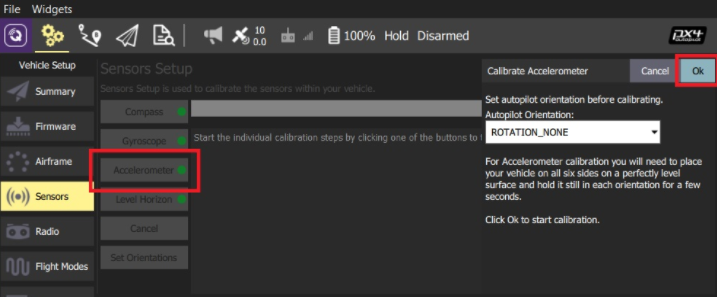
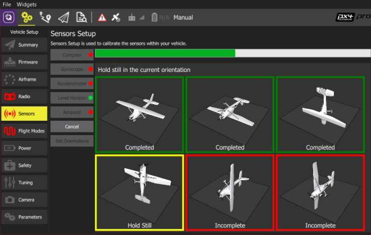

# Start-up PX4 Autopilot 
###What is PX4 Autopilot?
PX4 autopilot is an open-source autopilot system toward inexpensive autonomous aircraft. All hardware and software 
is an open-source and freely available to anyone under a BSD license. 

###What is QGroundControl?
QGroundControl (QGC) is an open-source, intuitive and poweful ground control station (GCS) for UAVs. It provides
full flight control and mission planning for any MAVLink enabled drone, and vehicle setup for both PX4 
and ArduPilot powered UAVs. This tool is oriented for both, first and professionals users.  

+ [User Manual](https://docs.qgroundcontrol.com/master/en/index.html)
+ [Developer Guide](https://dev.qgroundcontrol.com/master/en/index.html)
+ [Code - Github](https://github.com/mavlink/qgroundcontrol#:~:text=QGroundControl%20(QGC)%20is%20an%20intuitive,PX4%20and%20ArduPilot%20powered%20UAVs.)

1. **Transfer px4 code to hardware**
    
    1. **Create 'extras.txt' file**
        
        The system needs that IMU send to ROS (through MAVLink) the odometry at a higher speed than default
        settings, with the purpose of sync up LiDAR laser scans. For it, create a .txt file 
        with the code below: 
        
        + ***File name:*** extras.txt
        + ***Code:*** mavlink stream -d /dev/ttyS2 -s ODOMETRY -r 200
        
        **'/dev/ttyS2':** USB hardware port, it might change for different setups.  
    
    2. **Transfer PX4 drivers to hardware**
       
        In this paragraph, we have to transfer PX4-autopilot drivers to ROM memory,
       you could download official drivers on [here,](https://github.com/PX4/PX4-Autopilot) although IAS-CSIC has included a new protocol on GPS-Drivers, 
       NMEA that is compatible with our GPS model, download it from [here.](https://github.com/OpenAgriTech/PX4-Autopilot)
    
       After downloading the source code, follow the tutorial of [Building PX4 Software.](https://docs.px4.io/master/en/dev_setup/building_px4.html)
       NOTE: When the code is build, transfer it through QGC app. 
2. **Calibrate IMU**
   
   As we introduce before, we use QGC (QGroundControl) as the program for controlling internal parameters of the autopilot
   PX4. The calibration steps are: 
    
    1. Start QgroundControl and connect the vehicle.
    2. Select the Gear icon (Vehicle Setup) in the top toolbar ad then Sensors in the sidebar. 
    3. Click the Accelerometer sensor button.
       
       
    4. Click OK to start the calibration. 
    5. Position the vehicle as guides by the images on the screen. Once prompted (the orientation-image turns yellow) hold 
       the vehicle still. Once the calibration is complete for the current orientation the associated image on the screen
       will turn green.
       
       Repeated the calibration process for all vehicle orientations. Once you've calibrated the vehicle in all 
       positions QGroundControl will display 'Calibration complete' (all orientation images will be displayed in green 
       and the progress bar will fill completely). You can then proceed to the next sensors (Compass, Gyroscope, Level horizon, etc.). 
3. **Internal parameters**
   In this section, we'll show the critical configuration parameters for the use of autopilot integrated
   on this LiDAR development. As we said before, our setting interface is QGC, thus reference name of parameters 
   could change if you use a different software.
   
    + **GPS** 
        + 'GPS_1_CONFIG': TELEM1
        + 'GPS_1_GNSS': 0 (Default value)
        + 'GPS_1_PROTOCOL': Auto detect
        + 'GPS_2_CONFIG': Disabled 
        + 'GPS_DUMP_COMM': Disabled
        + 'GPS_UBX_DYNMODEL': Airbone with <2g acceleration
        + 'GPS_UBX_MODE': Default
        + 'GPS_YAW_OFFSET': 180º Degrees
    
    + **EKF2** 
        + 'EKF2_AID_MASK': 129 (Use GPS & GPS yaw fusion)
       
    + **MAVLINK** 
        + 'MAV_0_CONFIG': TELEM1
        + 'MAV_1_CONFIG': TELEM2
        + 'MAV_1_MODE': Onboard
        + 'MAV_1_RATE': 4600 B/s
        + 'MAV_2_CONFIG': Disabled
        + 'MAV_TYPE': Ground rover
    
    + **SERIAL** 
        + 'SER_TEL1_BAUD': 115200 8N1
        + 'SER_TEL2_BAUD': 921600 8N1

    
#####Resources: 
 - [QGroundControl User Guide](https://docs.qgroundcontrol.com/master/en/index.html)
 - [QGroundControl Developer Guide](https://dev.qgroundcontrol.com/master/en/index.html)
 - [MAVLink-QGroundControl - repository](https://github.com/mavlink/qgroundcontrol#:%7E:text=QGroundControl%20(QGC)%20is%20an%20intuitive,PX4%20and%20ArduPilot%20powered%20UAVs.)
 - [PX4 Autopilot official - repository](https://github.com/PX4/PX4-Autopilot)
 - [OpenAgritech PX4 Autopilot - repository](https://github.com/OpenAgriTech/PX4-Autopilot)
 - [Building PX4 Software](https://docs.px4.io/master/en/dev_setup/building_px4.html)
 - [PX4 Sensor calibration](https://docs.px4.io/master/en/config/accelerometer.html)
 - [PX4 Parameter Reference](https://docs.px4.io/master/en/advanced_config/parameter_reference.html)

